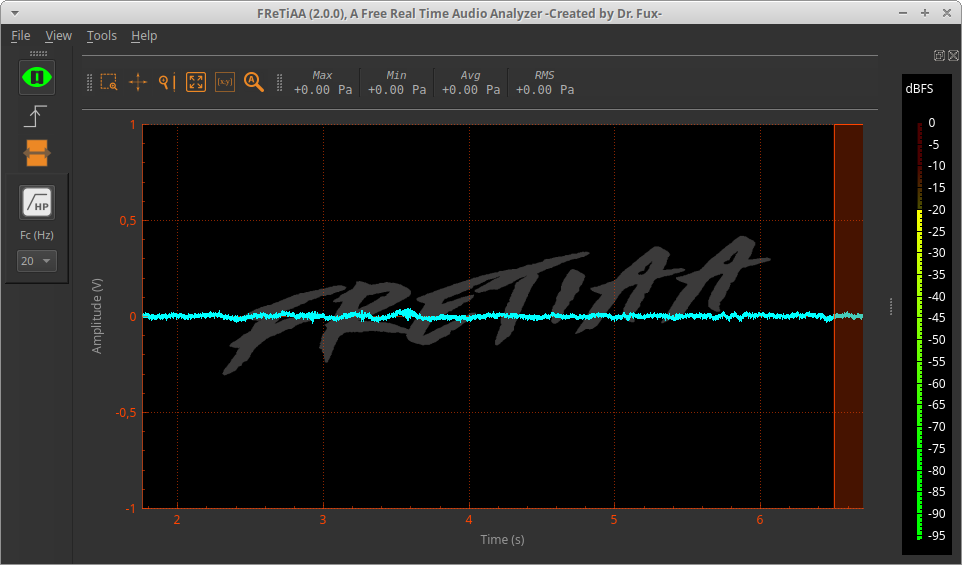

## FRETIAA2
-- Free REal TIme Audio Analyzer --

pronounced \fʁe.ti.ja\ ("frétilla", which means wagged in french) also accept \fʁe.s.ia\ , which means nothing I think ;-).

---

Fretiaa2.0 is a software to make real time audio /acoustical analyses.

### 1- Tools

- **Oscillogram**
- **Spectrum**
- **Spectrogram** (Time-Frequency representation)
- **Fractional-Octave-Band Spectrum** (e.g. 1-Octave, 1/3-Octave, ...):  [according to the [NF EN 61260:1995 Standard](https://www.boutique.afnor.org/norme/nf-en-61260/electroacoustique-filtres-de-bande-d-octave-et-de-bande-d-une-fraction-d-octave/article/621055/fa026550)]
- **VU-Meter** (in dBFS)
- **dB-Meter**: A-, C- or Z- Weighting, and Fast, Slow or Impulsional time integration  [according to the [NF EN 61672-2:2002 standard](https://www.boutique.afnor.org/norme/nf-en-61672-2/electroacoustique-sonometres-partie-2-essais-d-evaluation-d-un-modele/article/708938/fa120317)]
- **MultiMeter**: maximum, minimum, average and RMS (Root-Mean-Square) values

All charts include exploration tools (zoom, auto zoom, selection of Region of Interest), axes ranges and single value viewing.

### 2- Fonctionnalities

- Hear the signal 
- Open/Save the signal as audio file (.wav file)
- RealTime HighPass-filter (Fc=20Hz)
- Single Shot Trigger: stop recording when the signal exceeds teh trigger level
- Signal amplitude adjustement according to the input acquisition set-up (mic, preAmp, ADC input gain (in *dB*, *dBV* or *dBu*)
- Choose between *Volt* and *Pascal* representation unit
-  Select zone using rectangle used to compute *Oscillogram*, *Spectrum*, *Spectrogram*, *Octave-spectrum*, *Multimeter*, *dB-Meter*, or *VU-Meter*
- Export data from charts in csv format
- Export graphs as pictures
